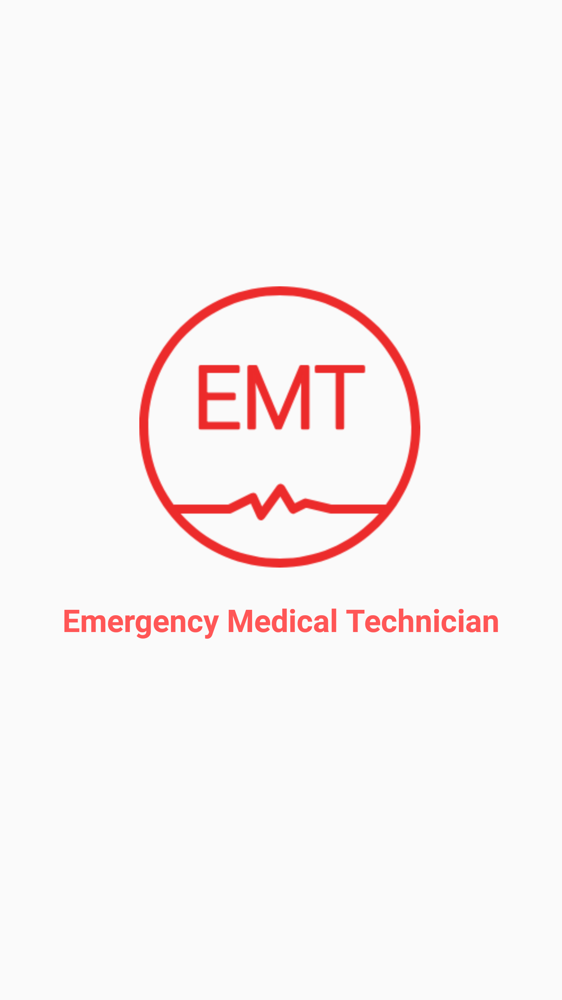
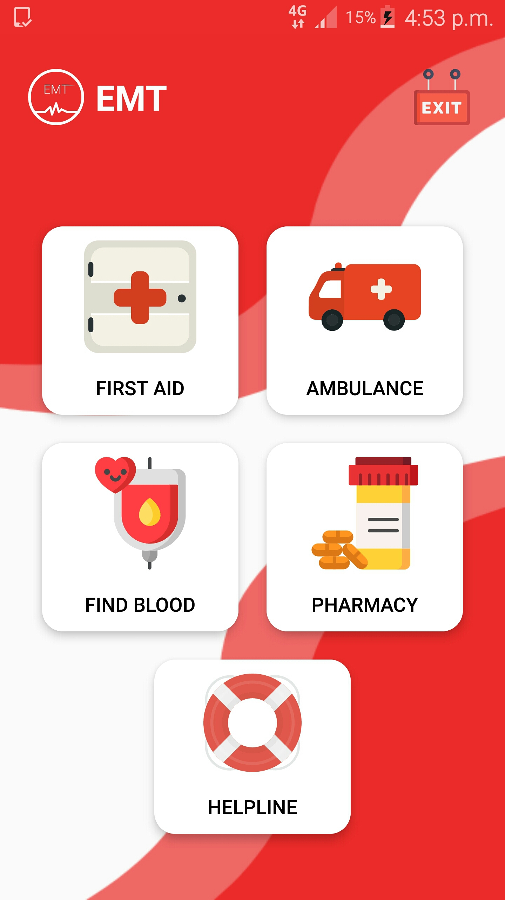
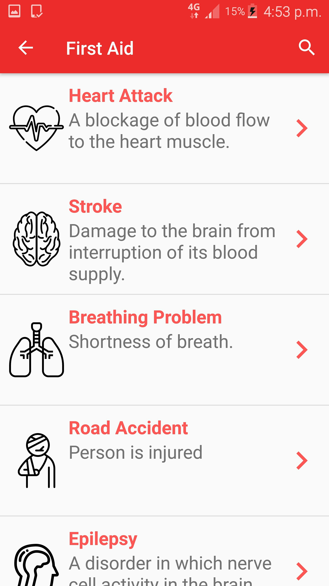
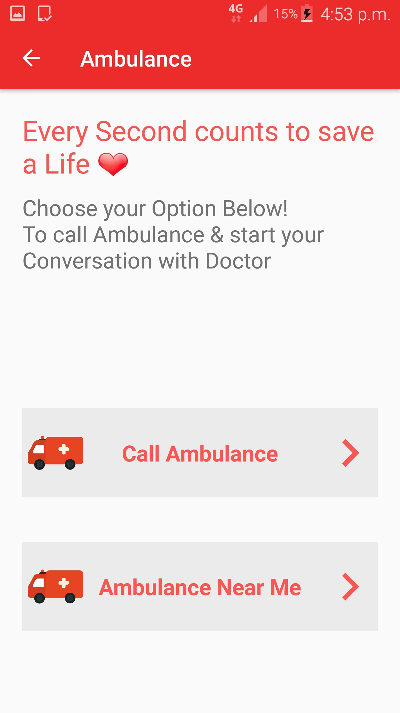
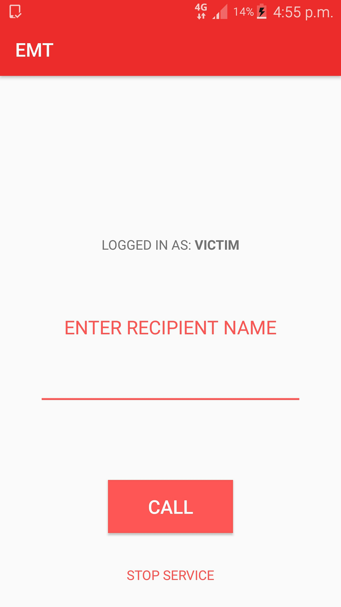
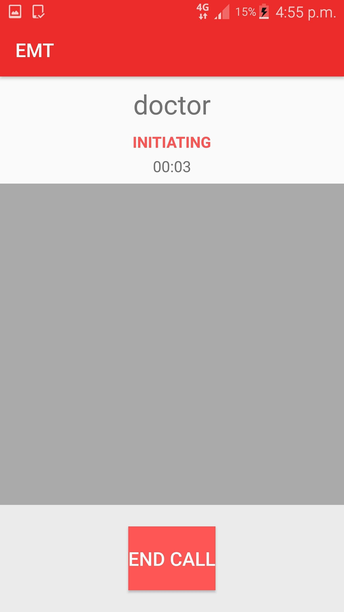

# <b>[EMT]</b> EMERGENCY MEDICAL TRAINEE
I have Created an Android App for "EMERGENCY MEDICAL TRAINEE" aka [EMT] which I have developed video calling feature. So that when any medical Emergency occur another person can video call with ambulance doctor till ambulance approach at the victim site

<b>Screenshots</b>  

